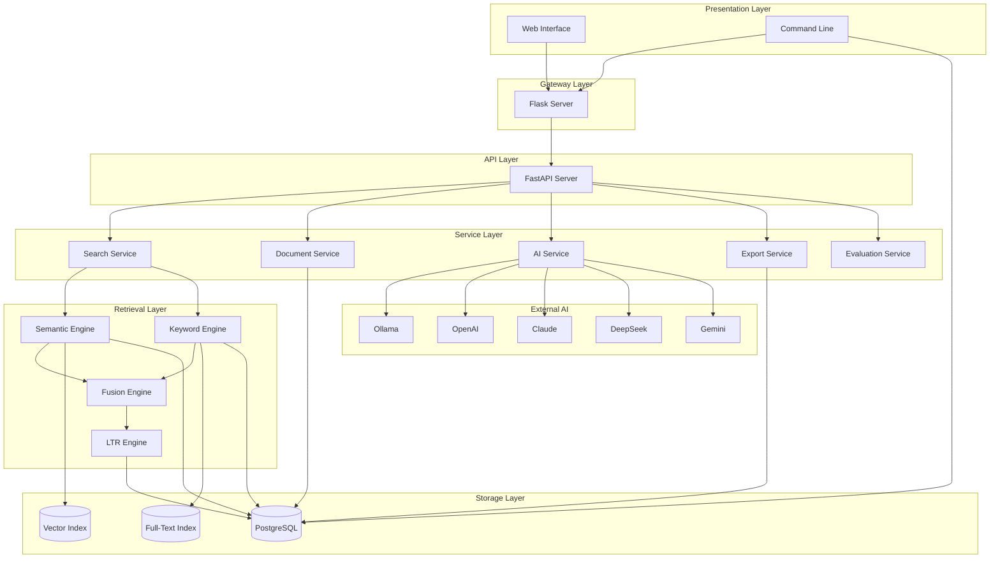
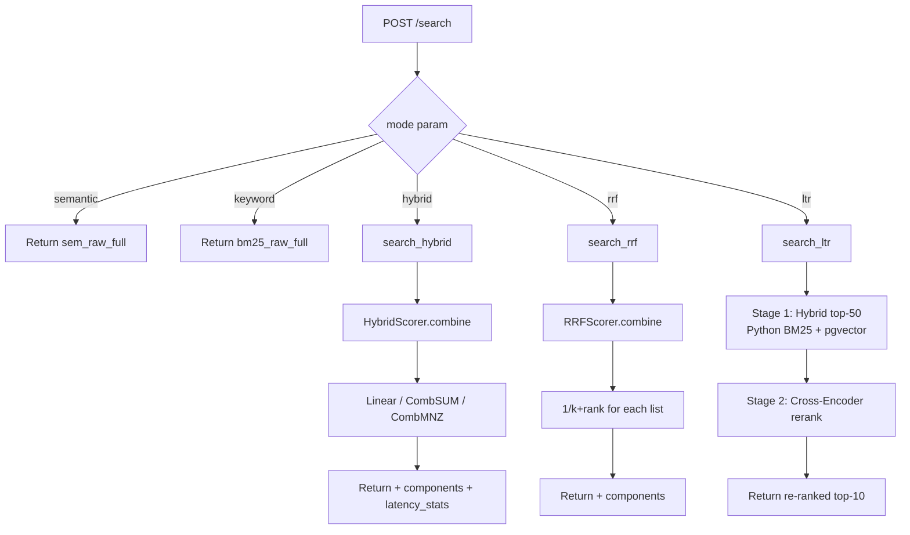
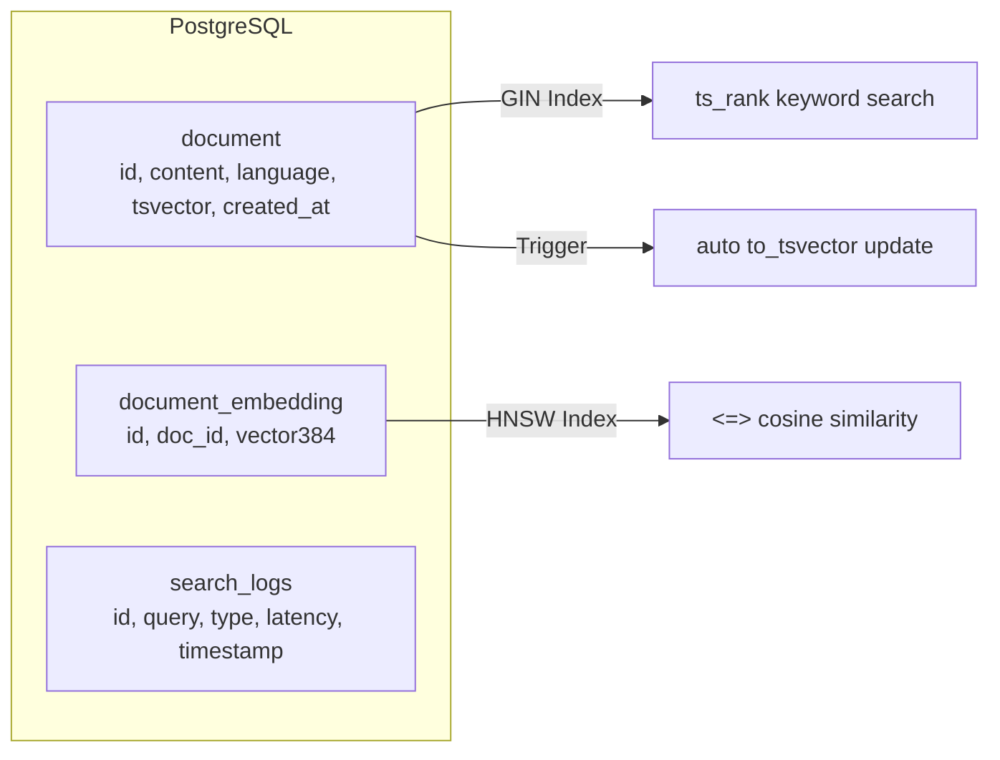

# Architecture

## Layer Diagram



## Component Map

| Layer | Component | File | Role |
|-------|-----------|------|------|
| **Presentation** | Web Interface | `flask_app.py` + templates/ | Renders HTML, serves JS/CSS, AJAX SPA |
| **Presentation** | Command Line | `main.py` | 12-command menu for document/search/eval |
| **Gateway** | Flask Server | `flask_app.py` | Proxies API calls, renders templates, static files |
| **API** | FastAPI Server | `app.py` | 15 REST endpoints, validation, orchestration |
| **Service** | Search Service | `app.py` | Mode dispatch, universal gathering, format |
| **Service** | Document Service | `document_management.py` | Insert, delete, update, re-embed |
| **Service** | AI Service | `app.py` + `ai/` | Multi-provider RAG, streaming chat |
| **Service** | Export Service | `export/core_logic.py` | Background JSON export |
| **Service** | Evaluation | `experiments/auto_eval.py` | 50-query auto-benchmark |
| **Retrieval** | Semantic Engine | `search_flask/semantic_search.py` | Vector cosine + boosts |
| **Retrieval** | Keyword Engine | `search_flask/keyword_search.py` | FTS + rank_bm25 |
| **Retrieval** | Fusion Engine | `HybridScorer.py` | Normalize + 3 strategies |
| **Retrieval** | LTR Engine | `LTRScorer.py` | Cross-encoder rerank |
| **Storage** | PostgreSQL | `db/db_connection.py` | 3 tables, GIN + HNSW indexes |
| **Storage** | Vector Index | pgvector HNSW | 384-dim cosine search |
| **Storage** | FTS Index | PostgreSQL GIN | tsvector keyword search |
| **External** | AI Providers | `ai/` directory | 5 providers via unified interface |

## Request Flow

```
User → Browser/CLI
  │
  ├── Flask (port 5000)
  │     └── GET / or POST /search
  │           └── requests.post(http://127.0.0.1:8000/search)
  │
  └── FastAPI (port 8000)
        └── POST /search
              ├── get_db() → psycopg2 connection
              ├── Universal: search_semantic(top_k=50)
              ├── Universal: search_keyword(top_k=50)
              ├── Mode-specific fusion
              ├── Pagination
              ├── Log to search_logs
              └── Return SearchResponse JSON
```

## 5 Search Modes — Internal Dispatch



## Storage Architecture



## Design Decisions

| Decision | Rationale |
|----------|-----------|
| Flask proxies to FastAPI | UI rendering separated from pure API. Flask handles HTML/templates; FastAPI handles JSON/validation |
| Single PostgreSQL instance | Both tsvector and pgvector in one DB. No cross-service latency, no data sync |
| Universal top_k=50 | Every request fetches both semantic + keyword regardless of selected mode. Enables frontend strategy comparison charts |
| Lazy imports | SentenceTransformer, langchain, unstructured, matplotlib deferred to first use. Server cold start 15s vs 90s |
| Per-query normalization | Score normalization adapts to each query's result distribution. Not global |
| Singleton models | Embedding model (500MB) and cross-encoder loaded once via thread-safe lock |
| Dotenv config | All secrets in .env file, loaded by python-dotenv at both app.py and db_connection.py |
| CORS multi-origin | FastAPI allows localhost:5000, 8080, 8000 for development flexibility |
