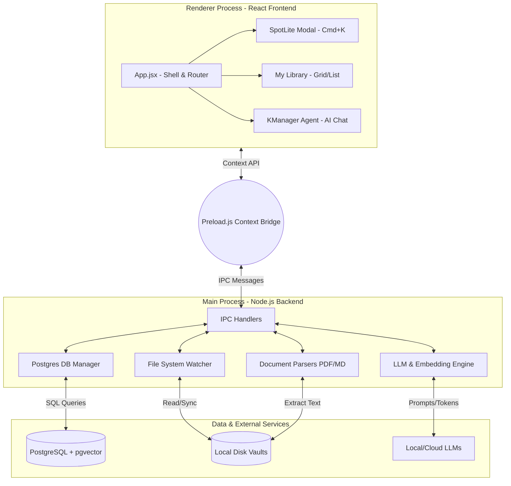

# KManager - Architecture & Developer Guide

KManager is a highly polished, local-first knowledge management application that combines advanced file organization with integrated AI capabilities (RAG, Semantic Search, and Contextual Chat). It is built as a desktop application using the Electron framework.

---

## 🛠 Technology Stack

### Core Frameworks
*   **Electron**: The desktop runtime providing native OS integration, local file system access, and multi-process architecture (Main, Preload, Renderer).
*   **React 18**: The UI library powering the renderer process.
*   **Vite**: The ultra-fast build tool and development server for the React frontend.

### Data & Backend (Main Process)
*   **Node.js**: Powers the backend logic (file parsing, system watching, IPC bridging).
*   **PostgreSQL + `pgvector`**: The core database. Used for storing document metadata, FTS (Full-Text Search) chunks, and vector embeddings for semantic search.
*   **Local File System (FS)**: KManager acts as a lens over the user's local directory structure, maintaining a synchronized state with physical files.

### UI & Styling (Renderer Process)
*   **Tailwind CSS**: Utility-first CSS framework for rapid, highly-customizable UI styling.
*   **Lucide React**: The unified icon library used throughout the application.
*   **React Markdown & Remark-GFM**: Used for rendering AI responses and Markdown documents with syntax highlighting, tables, and rich text.
*   **React Syntax Highlighter**: For rendering code blocks within AI chats and markdown files.

### AI & LLM Integration
*   **Ollama (Local)** / **DeepSeek / OpenAI (Remote)**: The LLM providers powering the KManager Agent.
*   **RAG Pipeline**: Retrieves highly relevant document chunks using hybrid search (Trigram + Vector similarity) and injects them into the AI context window.

---

## 🗺 System Architecture

The application strictly follows Electron's inter-process communication (IPC) model to ensure security and performance. The React frontend never touches the database directly.

---

## ✨ Core Features & Components

### 1. SpotLite (`SpotLite.jsx`)
Inspired by macOS Spotlight and Raycast. Triggered globally via `Ctrl+K` or `Cmd+K`.
*   **Instant Hybrid Search**: Debounced, lightning-fast search hitting the Postgres database for instant file retrieval.
*   **Zero-Latency Switching**: Uses React 18 `useTransition` and CSS `display: hidden` toggling to switch between "Search" and "AI" modes instantaneously without unmounting heavy DOM nodes.
*   **Inline Previews**: Previews document contents on the right side, allowing users to copy paths, toggle editing, or read without opening the full file.

### 2. KManager Agent (`ChatBot.jsx`)
The dedicated AI assistant that sits on top of your knowledge base.
*   **Context-Aware**: Can be injected with a `contextFile` (e.g., when triggered from a specific document) to answer "Explain this file" queries.
*   **Scope Toggling**: Users can constrain the AI's search scope (All Files, Recent Files, Current Folder) via an interactive UI badge.
*   **Real-time Typewriter Streaming**: Custom token-by-token rendering engine for a responsive, "alive" feel during generation.

### 3. My Library (`MyLibrary.jsx`)
The primary document browser and management interface.
*   **Dynamic Layouts**: Supports Large Grid, Small Grid, and List views.
*   **Smart Badging**: Automatically extracts file extensions or categories and highlights AI-generated content (e.g., `AI_RESPONSE`) with distinct glowing purple aesthetics.
*   **Keyboard Shortcuts**: Advanced user shortcuts (`Ctrl + /` to focus search) for a mouse-free experience.

### 4. Continuous File Sync
The Main process continuously watches designated local folders. When a user creates a new note or adds a PDF, KManager parses the text, generates vector embeddings, and silently upserts the data into PostgreSQL, making it immediately available to the RAG pipeline.

---

## 🚧 Pending UI & State Fixes (ChatBot)

The following known issues currently exist in `ChatBot.jsx` and require fixing:

1. **Textarea Styling**: The input wrapper div uses overly large rounded corners (`rounded-[24px]` or `rounded-2xl`). This needs to be reduced to a tighter `rounded-[5px]` radius for a cleaner aesthetic.
2. **Layout Shift (Jumping Response)**: When the AI finishes generating its response, the response block "falls" or shifts down. This is likely caused by the unmounting of the `isTyping` indicator (`Bot ... Thinking...`), which removes padding/margin from the DOM and causes a layout jump before the final scroll adjustment.
3. **State Persistence Bug (Auto-Running Prompt)**: Closing the ChatBot and re-opening it currently re-triggers or pre-fills the last prompt automatically. The component's state (`messages`, `input`) is not being properly cleared out or reset upon the modal closing/re-opening.
