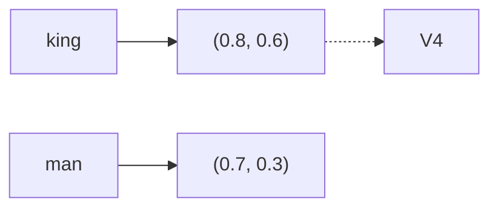
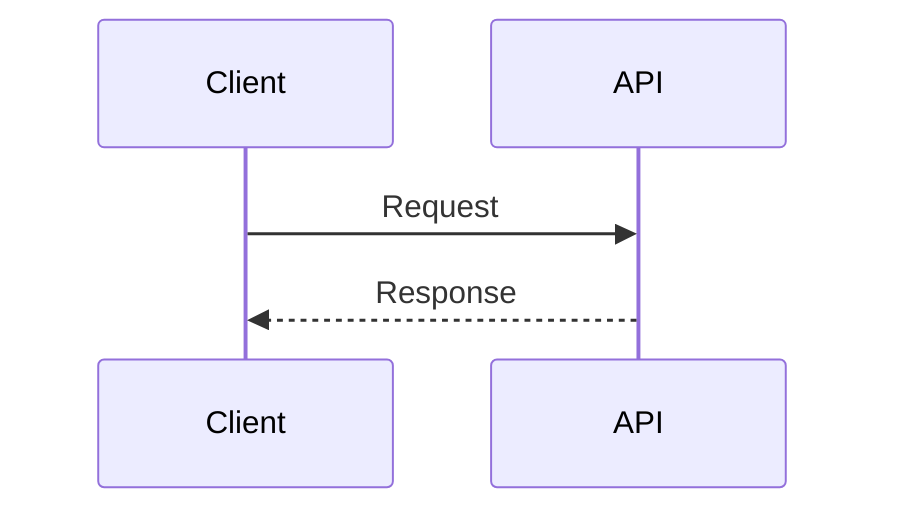

## 🎯 Mermaid Diagram Regex Issues & Fixes

### Problem Summary

Your `formatMarkdownText` function has **4 regex patterns** that corrupt Mermaid diagrams:

1. **Code block isolation** (lines 61-64) - Adds extra newlines inside Mermaid diagrams
2. **Table detection** (lines 88-151) - Misinterprets Mermaid arrows (`-->`) and pipes (`|` in node labels) as markdown tables
3. **Wikilink conversion** (line 71, 75) - Interprets `[[` inside Mermaid labels as wikilinks
4. **Paragraph joining** (lines 163-183) - Merges Mermaid code block lines into paragraphs

---

### ⚠️ Critical: Know Your Code's Dependencies

**Before making changes, understand these relationships:**

1. **Your `formatMarkdownText` is called by `formatJsonContent`** - Changes here affect JSON rendering too
2. **The table detection (lines 88-151) expects specific markdown table formats** - Your Mermaid diagrams might have `|` in node labels or arrow syntax that looks like tables
3. **The paragraph joining logic (lines 163-183) reassembles text into paragraphs** - It treats code blocks as "special lines" that shouldn't be merged, but Mermaid diagrams need special handling
4. **Your `resolveRelativeMedia` handles image paths** - If Mermaid diagrams contain image references, this function might be affected
5. **The wikilink conversion happens at line 71 and 75** - It converts `[[page]]` to inline wikilink tokens that your UI renders differently

---

### 🔧 The Fix: Preserve Mermaid Blocks First

**Strategy:** Extract all Mermaid diagrams BEFORE any regex processing, then restore them AFTER all transformations.

```javascript
// STEP 1: Extract and store all mermaid blocks with placeholders
const mermaidBlocks = []
let mermaidIndex = 0

let result = text.replace(/```mermaid([\s\S]*?)```/g, (match) => {
  const placeholder = `__MERMAID_BLOCK_${mermaidIndex}__`
  mermaidBlocks.push(match)
  mermaidIndex++
  return placeholder
})

// STEP 2: Run ALL your existing regex transformations on `result`
// (The mermaid blocks are now safe as placeholders)

// STEP 3: Restore the mermaid blocks
mermaidBlocks.forEach((block, i) => {
  result = result.replace(`__MERMAID_BLOCK_${i}__`, block)
})
```

---

### 📝 Where to Apply This Fix

| Function Section | What to Change | Why Careful |
|------------------|----------------|-------------|
| **Start of function** | Add mermaid extraction before any processing | Your other transformations (math, wikilinks, citations) should NOT run on mermaid blocks |
| **Line 61-64** (code block formatting) | These can stay as-is since mermaid blocks are now placeholders | The ```` ``` ```` detection will now see placeholders instead of actual code blocks |
| **Line 88-151** (table processing) | Add `if (line.includes('__MERMAID_BLOCK_')) continue;` before table detection | This section has `inTable` state that could get confused by placeholders |
| **Line 163-183** (paragraph joining) | Add `if (trimmed.includes('__MERMAID_BLOCK_')) { cleanedParagraphs.push(line); continue; }` | This section's `insideBlock` state and paragraph merging would break on placeholders |
| **End of function** | Add mermaid restoration before returning | This must happen AFTER all transformations but BEFORE the final capitalization and punctuation cleanups |

---

### 🔍 Alternative: Conditional Processing with State Tracking

If preserving blocks is too heavy, use a state-based approach:

```javascript
// At the start of the function:
let inMermaid = false

// Before any regex operation:
if (text.includes('```mermaid') && !text.includes('__MERMAID_BLOCK_')) {
  // Skip this transformation for lines containing mermaid blocks
  // Or use negative lookbehind: (?<!```mermaid)
}

// In the table detection loop (lines 88-151):
if (trimmed.includes('```mermaid') || trimmed.includes('-->')) continue;

// In the paragraph joining loop (lines 163-183):
if (trimmed.includes('```mermaid')) {
  inMermaid = true
  cleanedParagraphs.push(line)
  continue
}
if (inMermaid && trimmed.includes('```')) {
  inMermaid = false
  cleanedParagraphs.push(line)
  continue
}
if (inMermaid) {
  cleanedParagraphs.push(line)
  continue
}
```

---

### ⚠️ Critical Dependencies to Consider

1. **Your `formatJsonContent` function** - It calls `formatMarkdownText` and expects the output to be properly formatted. If you break Mermaid diagrams, JSON content rendering will fail.

2. **Your table normalization logic** - The table detection (lines 88-151) has complex logic to fix malformed tables. This logic relies on detecting pipes (`|`). Mermaid diagrams with pipes in labels will trigger this logic incorrectly.

3. **Your paragraph joining logic** - This reassembles paragraphs from extracted PDF text. It uses the `isSpecialLine` flag to detect code blocks. Mermaid diagrams will not be detected correctly without special handling.

4. **Your citation and wikilink handling** - The citation extraction (lines 83-97) and wikilink conversion (lines 71, 75) run BEFORE the paragraph joining. If Mermaid diagrams contain `[[` or citation patterns, they'll be incorrectly converted.

5. **Your final capitalization logic** - The last steps of the function (lines 160-184) apply capitalization and formatting to the entire text. If a Mermaid diagram's placeholder gets capitalized, it will be corrupted when restored.

---

### ✅ Priority Fixes (Quick Wins)

1. **Table detection fix** (most critical):
   ```javascript
   // Add this at the start of table detection loop:
   if (trimmed.includes('-->') || trimmed.includes('->>')) continue;
   // Add this for pipe detection:
   if (trimmed.includes('__MERMAID_BLOCK_')) continue;
   ```

2. **Wikilink fix**:
   ```javascript
   // Only convert wikilinks if NOT inside a mermaid block:
   // Move the wikilink conversion to AFTER mermaid extraction
   // Use the placeholder approach instead of trying to detect in-line
   ```

3. **Paragraph joining fix**:
   ```javascript
   // Add a variable at function start:
   let insideMermaid = false
   
   // In the loop (lines 163-183):
   if (trimmed.startsWith('```mermaid')) {
     insideMermaid = true
     cleanedParagraphs.push(line)
     continue
   }
   if (insideMermaid && trimmed.startsWith('```')) {
     insideMermaid = false
     cleanedParagraphs.push(line)
     continue
   }
   if (insideMermaid) {
     cleanedParagraphs.push(line)
     continue
   }
   ```

---

### 🧪 Test Cases to Verify

After applying fixes, test these Mermaid diagrams:





```mermaid
graph TD
    A[Node with | pipe | in label] --> B[Another node]
```

**Expected:** All render correctly without parsing errors.

---

### 📋 Agent Checklist

- [ ] Extract mermaid blocks with placeholders at function START (before any processing)
- [ ] Skip ALL transformations on placeholder text
- [ ] In table detection (lines 88-151): add `if (trimmed.includes('__MERMAID_BLOCK_')) continue;`
- [ ] In paragraph joining (lines 163-183): add `if (trimmed.includes('__MERMAID_BLOCK_')) { cleanedParagraphs.push(line); continue; }`
- [ ] In wikilink conversion (lines 71, 75): move to after mermaid extraction
- [ ] In citation extraction (lines 83-97): add `if (!line.includes('__MERMAID_BLOCK_'))`
- [ ] Restore mermaid blocks at function END (after all transformations but before final cleanup)
- [ ] Test with at least 3 different mermaid diagram types
- [ ] Test with diagrams containing pipes (`|`) in labels
- [ ] Test with diagrams containing `-->` arrows
- [ ] Test with diagrams containing `[[` wikilink-like syntax
- [ ] Verify `formatJsonContent` still works with JSON data
- [ ] Verify table detection still works with markdown tables

---

### 🔑 Key Insight

**The most important thing to understand is that your `formatMarkdownText` function is trying to be too clever.** It's making assumptions about the text structure (PDF extraction, markdown, JSON) and applying transformations that work for those formats but break Mermaid diagrams.

**The safest approach is the placeholder extraction method** because it:
1. Preserves Mermaid diagrams exactly as they are
2. Allows all your other transformations to work on non-Mermaid content
3. Restores the diagrams at the end without corruption
4. Doesn't require modifying your existing regex logic (which works for markdown/PDF content)

This approach is also **future-proof** - if you add more regex patterns later, they won't affect Mermaid diagrams because the placeholders won't match any regex patterns except the exact restoration logic.